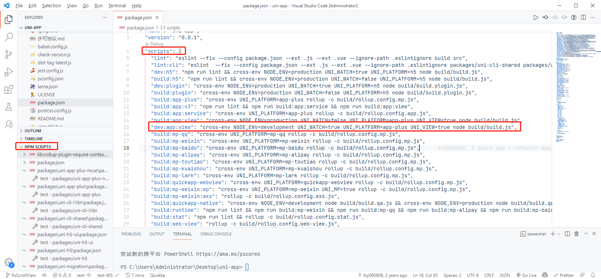

现代前端项目，都是使用 node 运行项目，如果我们突然对某个库，框架感兴趣，就会主动去 Github 上拉去源代码  
但是拉下源码之后，遇到的第一个问题就是，项目看不懂，不知道从何处看起  
或者知道从 package.json 看项目的打包命令，但是最后迷失在一个个 .js 文件中  

毕竟优秀的开源项目也是日积月累的写编码，而且在进化的路上不断地重构，到最后将代码的抽象度变得极高，这就使我们在看代码的时候会有巨大的阻力，哪怕是打包过程，理解起来都不会容易

那么，现在，你只需要一个 vscode 就可以了  

首先，将自己要学习的源代码使用 vscode 打开   
这里以 uni-app 源码为例子  

将项目打开后，可以看到一堆 script 命令和左侧的命令执行页面  

一般开源项目的本地调试都是跟 dev 相关的脚本，可以看到，此命令是执行的 build/build.js 文件，然后我们去往根目录下找到这个文件  

   
 在找到的文件处打好短点，然后点击 vscode 那个甲虫的图标，当执行到断点处的时候，项目就会停住，左侧就会出现 node 项目的调试控制台，其中可以看到各种变量的参数，以及配置，当跟着断点处向下执行的话，就可以轻松的找到项目的主入口  

 注意事项：  
 1. 有些开源项目本地调试需要在 script 的后边加上 --debug 参数，--sourceMap 参数，详情请参见各开源项目的打包工具以及个人经验积累  

 2. 有时候打完包生成的 dist 文件夹的文件运用的项目中调试，是没有 console.log 的，这需要检查打包配置中是否有将全局 console 赋值为其他变量，或者检查打包环境是否为 dev   

 个人经验，暂时先写到这里

